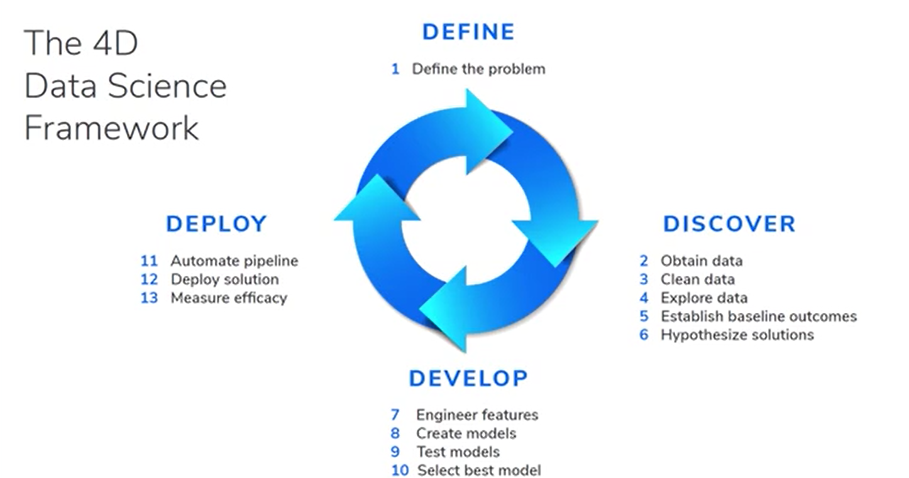
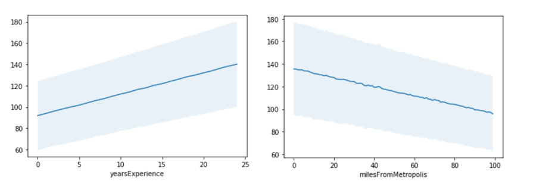
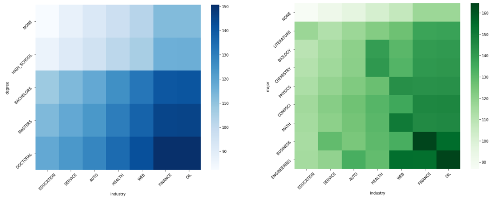
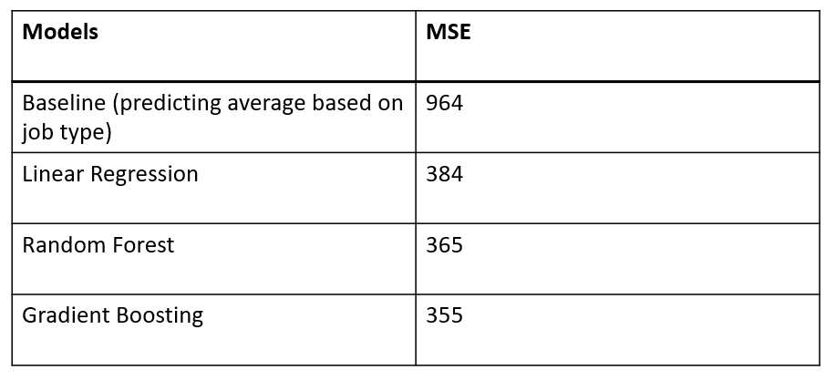
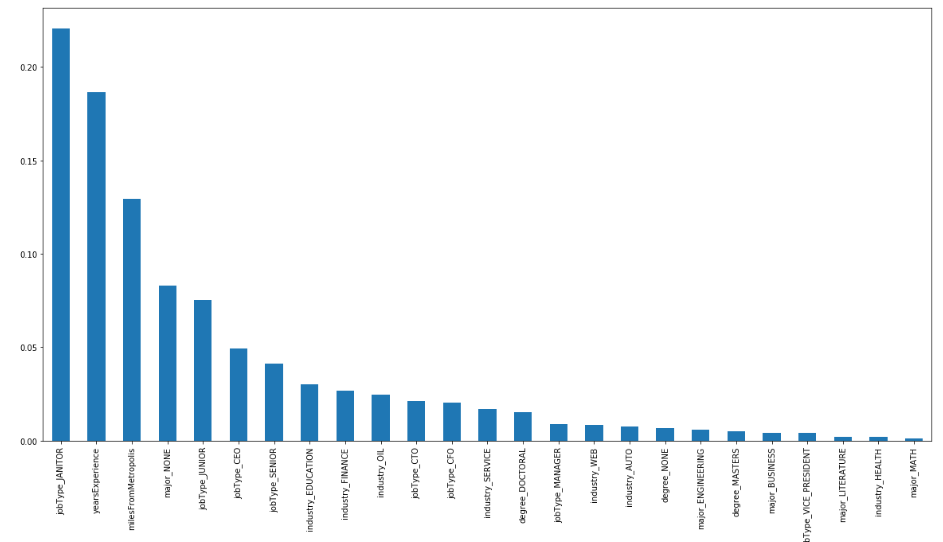

# Salary analysis & prediction

## Project Summary

This project will analyze salaries of job descriptions based on job type, industry, major, degree, years of experience, miles away from city, and predict salaries of job descriptions to allow companies to allocate budget for new hires and avoid overspending. Based on how the above variables influence salary, candidates can also strategically target the type of company they want to work for to achieve their desired salary.

Exploratory Data Analysis will be conducted by visualizing relationships among all variables, and 3 machine learning methods, Linear Regression, Random Forest, and Gradient Boosting, will be applied to predict salaries. The model with the lowest Mean Squared Error (MSE) will be implemented. MSE is the chosen metric because we want to see how predicted salary compare with actual salary. As a guideline, we are aiming for MSE<360.

The project will be completed using the 4D framework: Define, Discover, Develop, Deploy.

*Concept discussed by Kyle McKiou*

End to end solution is linked: [Solution](https://github.com/tjeng/projects/blob/master/salary.ipynb)

## Define 

Companies often face a problem of **over spending** on new hires, whereby they spend more money than they have to hire new people. Over spending would negatively impact the financial health of the company and result in decreased profit, debts, and even bankcruptcy if uncontrolled. 

Imagine that a company spends **500,000 dollars** on new hires annually when it has **200,000 dollars**. The company incurs a deficit of **300,000 dollars**. The company can avoid over spending by knowing how much new hires are going to cost, and compare the cost with what they have, to determine who and how many people they can hire.

## Discover (EDA)

The data set consists of 10k rows and 9 columns with the following information:

### Distribution plots (y-axis represents density - probability of value being observed in the data set)

Salary follows a close to normal distribution, implying that a most of the jobs pay close to the average salary, with equally few jobs that are extremely low and high paying. On the other hand, years of experience and miles from metropolis have a uniform distribution, implying that there is an equal number of jobs with varying years of experience and miles away from city.

### Relationship between independent variables and salary 

Salary increases linearly with increasing years of experience and decreases linearly as location is further away from the city. The standard deviation shows the variation around the mean. For example, a candidate with 5 years of experience will earn an average of $100k but salary ranges from $70-$130k. As we can see later, the variation in salary depends on industry and type of position.

*Job type and average salary*

Executive positions (CFO, CTO, CEO) have the highest average salaries while janitor has the lowest average salary. Senior and manager positions do not have huge difference in average salaries.

*Degree and average salary*

There is not much difference in average salaries between jobs that do not require a degree and those that require a high school degree. Jobs with bachelor's degree requirements have slightly lower average salaries than those with master's and doctoral degree requirements, while the latter have similar average salaries.

*Major and average salary*

Average salaries of different majors are roughly similar, except for jobs that do not require a major that have lower average salaries, which could mean that candidates for these jobs have at most a high school degree.

*Industry and salary*

Finance and oil are the highest paying industries.

### Relationship between multiple independent variables and salary

*Degree and industry*

It is interesting to see that more advanced degree do not pay much higher in the same industry. It is the type of industry that heavily influences salary.

*Industry and major*

This is an interesting trend as we see that majors that are directly related to industry are paid higher. Literature major is paid more in the education industry, business major is paid more in the service and finance industries, especially the latter. Biology and chemistry majors are paid more in the health industry. Engineering major is highly paid in the auto, web, finance, and oil industries.

## Develop

One-hot encoding is applied to transform categorical features into numeric where each category becomes a column with values 0 or 1 indicating whether that value is absent or present in the column. 

After which, data is split into training and testing sets of 80% and 20% respectively.

There is linear relationship between the variables and salary, hence a linear regression model is one of the models we will try given that its easily interpretable and productionalize. We will also try Random Forest and Gradient Boosting, both are tree-based ensemble models that unlike the linear regression model, are robust to outliers and do not require parametric assumptions in the data. Model results are shown below:

Feature importances of the Gradient Boosting model is shown below:

Job type, years of experience, and location influence salary more than degree and major. Looking at the top 5 features for job type, junior and janitorial positions have more predictable salary compared to other positions. This is possible because entry-level and certain types of position are more likely to have a fix salary. It is intuitive that years of experience and location strongly influence salary as people get compensated more if they have more years of experience and are closer to the city, vice-versa. Feature importance for Random Forest shows similar patterns.

## Deploy

Since our goal is to select the model that achieves the lowest MSE, we will select the **Gradient Boosting** model. The model is trained on the entire training set and applied on unknown data to predict salary of job descriptions. The output is a csv file with salary predictions that is handed to the finance team or hiring managers so that they can allocate budget based on hiring requirements or adjust hiring requirements based on alloted budget.

## Actionable recommendations

Since job position, years of experience, and location strongly influence salary, a company's finance team might want to consider these factors when allocating budget for new hires. On the other hand, if a company has fixed budget on new hires, they can decide what kind of position to hire for based on how much they have. For instance, if a company has $200k budget, then it can afford to hire a managerial position, instead of a VP.

Salary varies according to the following

- Job position: CEO > CTO & CFO > VP > Manager > Senior > Junior > Janitor
- Salary increases linearly with years of experience
- Salary decreases linearly with miles away from city
- Oil and finance industries are the highest paying, auto, health, and web are average paying, while service and education are the lowest paying.

Based on this information, candidates can also decide the type of industry, location, and position to target to achieve the desired salary. For example, if an entry-level candidate is looking to earn a lot of money, he or she should work in the city in the oil or finance industry. However, living in the city also cost more, and he or she might want to think about where to live (shorter commute to work at the expense of a higher rent vs longer commute but lower rent) depending on priorities.

**Caveat**

The type of company and economy are important factors to consider when predicting salary but they are not included in the model. A start-up will pay less than a bigger company and salary will be lower during times of economic downturn. While it is important to consider the type of position and industry, we should also keep in mind other variables that are not included in the model.
